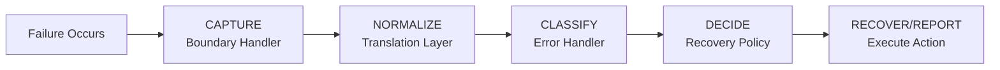
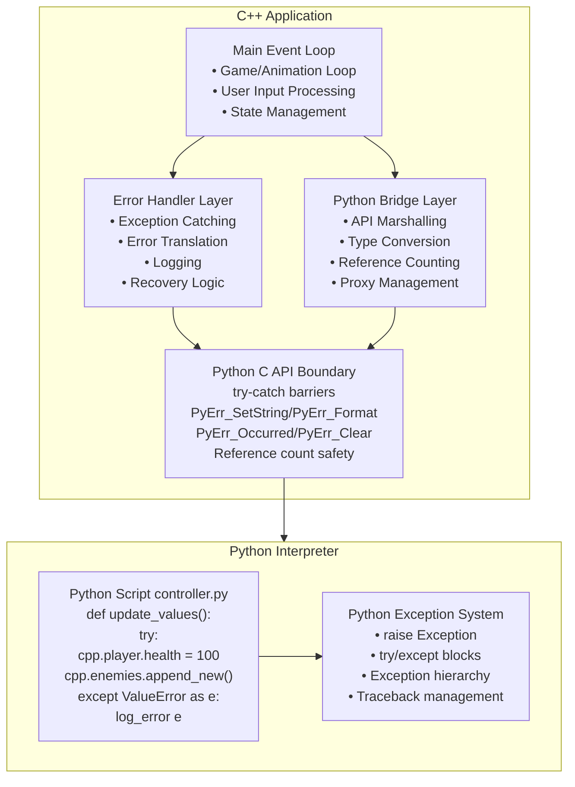
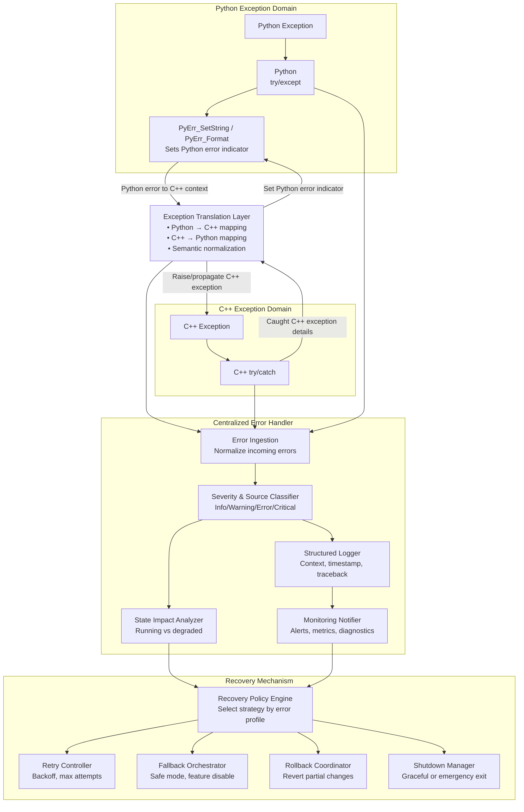
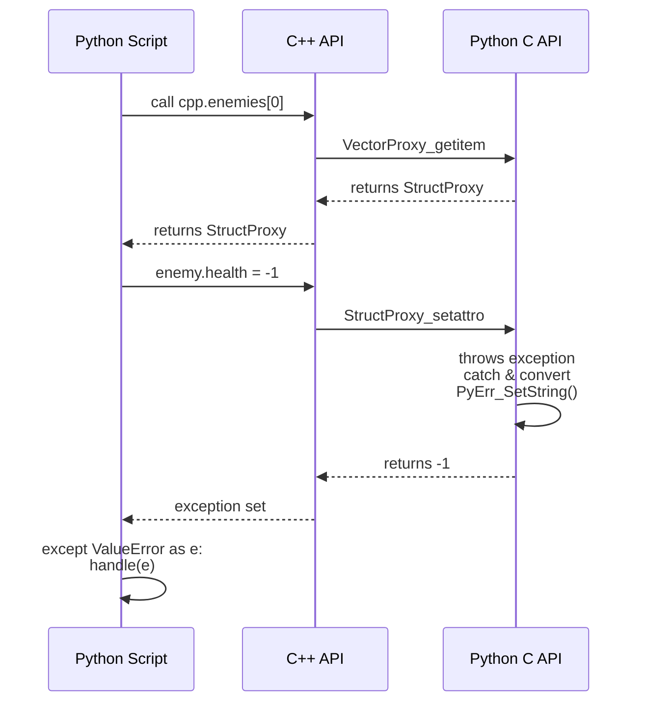
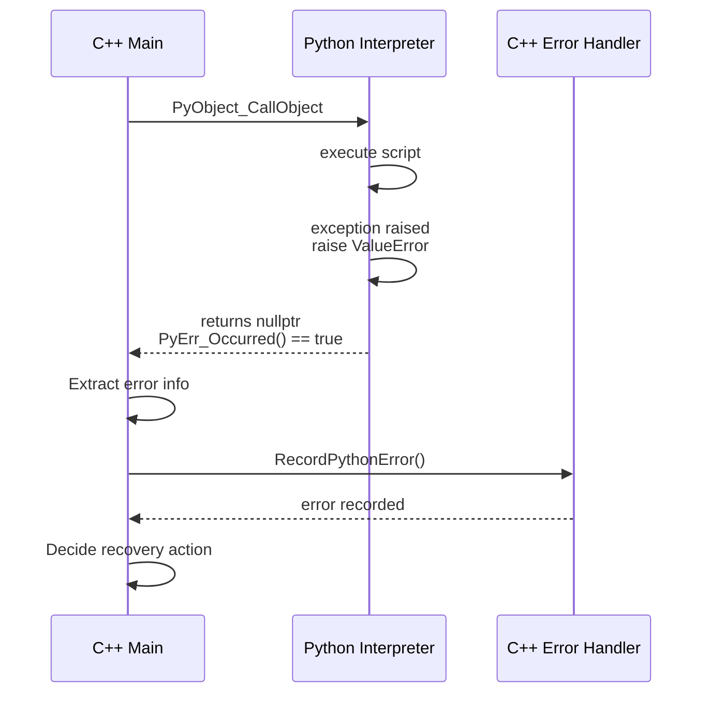
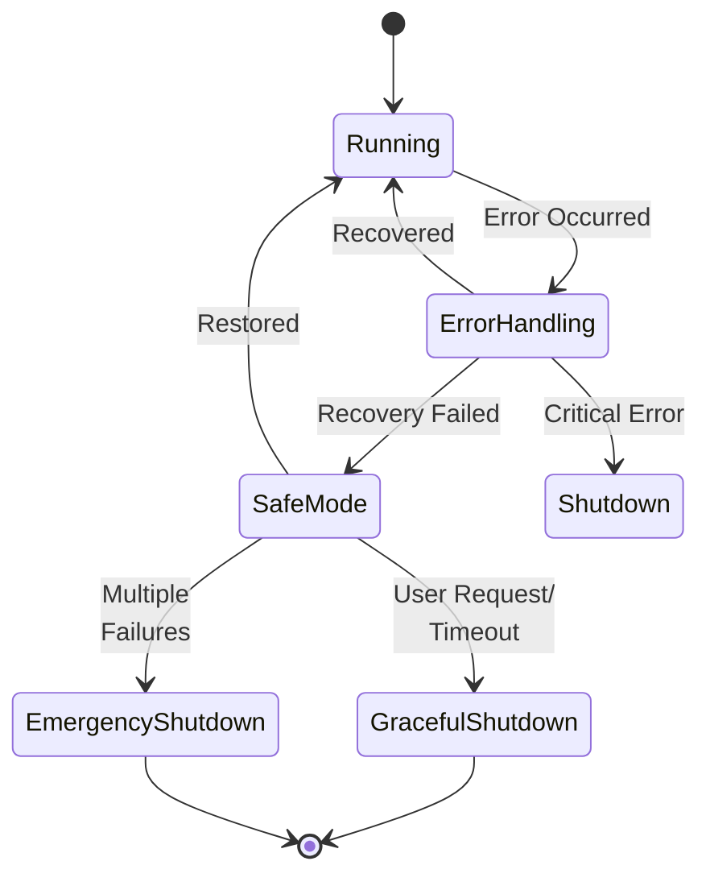
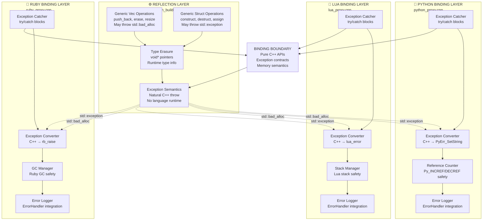

# Complete Error and Exception Handling Architecture
## C++ ↔ Python Integration Design

**Document Version:** 1.0  
**Date:** March 4, 2026  
**Status:** Architecture Design Document  
**Related Issues:** Issue 50-57

---

## Table of Contents

1. [Executive Summary](#executive-summary)
2. [Architecture Detail Intent](#architecture-detail-intent)
3. [Architectural Overview](#architectural-overview)
4. [Component Architecture](#component-architecture)
5. [Python-Side Error Handling](#python-side-error-handling)
6. [C++-Side Error Handling](#c-side-error-handling)
7. [Bidirectional Error Flow](#bidirectional-error-flow)
8. [State Management During Errors](#state-management-during-errors)
9. [Recovery Strategies](#recovery-strategies)
10. [Design Patterns](#design-patterns)
11. [Implementation Roadmap](#implementation-roadmap)

---

## Executive Summary

This document defines the complete architectural design for error and exception handling in a C++ application that embeds Python scripts with bidirectional data binding. The architecture ensures:

- **Safety:** No crashes from unhandled exceptions crossing language boundaries
- **Reliability:** Graceful degradation and recovery from errors
- **Observability:** Clear error reporting and diagnostic information
- **Maintainability:** Consistent patterns across all error scenarios
- **Extensibility:** Clean separation enabling support for Lua, Ruby, and other languages

### Fundamental Architectural Principle

**Reflection layer must remain pure C++ (no language-specific code)**

- ✅ Reflection functions throw standard C++ exceptions naturally
- ✅ No Python.h, Lua headers, or Ruby headers in reflection layer
- ✅ Each language binding (Python, Lua, Ruby) has its own proxy/translation layer
- ✅ Proxy layer responsibility: Catch C++ exceptions → Convert to language-specific errors
- ⚠️ Do NOT add Python-specific code to reflection_builder.hpp

This design allows:
- Single reflection implementation serving multiple scripting languages
- Reflection layer testable in pure C++ without language runtime
- Easy to add new language bindings (just add new proxy layer)
- Clean separation of concerns

---

### Key Design Decisions

| Decision | Rationale |
|----------|-----------|
| **Catch-and-Convert at boundaries** | Prevents crashes, maintains API contracts |
| **Centralized error logging** | Single source of truth for diagnostics |
| **Stateful error context** | Enables recovery and retry logic |
| **Exception translation layer** | Maps between C++ and Python error semantics |
| **Defensive programming** | Validates all cross-language data transfers |

---

## Architecture Detail Intent

The architecture is intentionally split into **execution domains** (Python runtime and C++ runtime) with a strict **boundary contract** between them. The key intent is to prevent exception leakage across language boundaries while still preserving enough semantic meaning for recovery, diagnostics, and maintainability.

### Intent 1: Safety (No cross-language crash from unhandled exceptions)

- **Python Script + Python Exception System** contain script-level failures locally with `try/except`.
- **Python C API Boundary** enforces Python contracts (`nullptr`/`-1` + exception indicator) so C++ never receives undefined interpreter state.
- **Exception Translation Layer** normalizes exception meaning when crossing domains (C++ exception categories ↔ Python exception types).
- **C++ try/catch and proxy boundary handlers** stop raw C++ exceptions from escaping into Python internals.

Result: exceptions are always caught at the boundary and converted into the receiving runtime's expected error model.

### Intent 2: Reliability (Continue operation with controlled degradation)

- **Centralized Error Handler / Error Ingestion** creates a single intake path for all error sources (Python, C++, translation, boundary).
- **Severity & Source Classifier** determines operational impact (warning vs error vs critical).
- **State Impact Analyzer** decides whether normal execution can continue or if degraded mode is required.
- **Recovery Policy Engine** selects an action path (retry, rollback, fallback, shutdown) based on severity, source, and context.

Result: failures become managed events with deterministic recovery behavior instead of ad-hoc local handling.

### Intent 3: Observability (Diagnosable failures with end-to-end context)

- **Structured Logger** records normalized error payloads with timestamp, context, and traceback/exception message.
- **Monitoring Notifier** emits actionable signals for dashboards/alerts.
- **Translation Layer + Ingestion** preserve source-domain details while adding destination-domain context.

Result: operators and developers can trace where an error started, how it was translated, and what recovery decision was taken.

### Intent 4: Maintainability (Clear ownership and low coupling)

- **Python Bridge Layer** owns marshalling, conversion, and proxy behavior.
- **Reflection/Core C++ layer** remains language-agnostic and focused on domain logic.
- **Error Handler and Recovery Mechanism** centralize policy, avoiding duplicated decision logic in each call site.

Result: changes to error policy happen in one place, while scripting integration remains thin and replaceable.

### Intent 5: Extensibility (Support additional scripting runtimes)

- The same boundary pattern can be reused for Lua/Ruby by adding runtime-specific proxy/translation handlers.
- Core C++ reflection and recovery subsystems remain unchanged.
- Only runtime-specific exception mapping and resource safety adapters need to be implemented.

Result: new language bindings can be added without redesigning core architecture.

### Component Interaction Walkthrough (Typical Failure Path)

1. Python operation fails or C++ operation throws.
2. Boundary handler captures the failure and forwards through the **Exception Translation Layer**.
3. Translated error is ingested by **Centralized Error Handler**.
4. Error is classified, logged, and evaluated for state impact.
5. **Recovery Mechanism** policy selects retry/rollback/fallback/shutdown.
6. Outcome is reported to monitoring and control returns to the main loop with updated state.

This flow ensures every failure follows the same lifecycle: **capture → normalize → classify → decide → recover/report**.

### Failure Lifecycle Diagram



---

## Architectural Overview

### High-Level Architecture



**High-Level Architecture Explanation**

The diagram illustrates three distinct execution domains where error handling must be managed at boundaries:

1. **C++ Application Domain** (left): The main event loop runs C++ code that initiates operations. The Error Handler Layer monitors for exceptions and provides the first line of defense. The Python Bridge Layer acts as the transition point, preparing for calls across the language boundary.

2. **Python C API Boundary** (center): This is the critical isolation layer. The Python C API (CAPI) enforces strict contract semantics—any exception that occurs must be captured and converted before crossing. This boundary prevents unhandled C++ exceptions from crashing the Python interpreter and vice versa. No exception is allowed to leak across this barrier.

3. **Python Interpreter Domain** (right): Once the boundary is safely crossed, Python code executes in its own interpreter context with its own exception model. Python errors are caught using standard try/except mechanisms and communicated back to C++ via the C API's error indicator mechanism.

**Key Design Point**: The unidirectional arrows indicate that exceptions must be explicitly caught, translated, and converted at each boundary crossing. This prevents language-specific exception semantics from propagating uncontrolled across language domains and ensures both the C++ application and Python interpreter remain in stable, recoverable states.

### Error Flow Components



**Error Flow Components Explanation**

The diagram maps four major functional areas that work together to handle errors as they move up from failure point to recovery decision:

1. **Python Exception Domain** (top-left): Represents the Python side of error capture. Python code raises exceptions, which are caught via `try/except`, and then reported to C++ using the Python C API's error indicator mechanism (`PyErr_SetString`/`PyErr_Format`). This domain is purely Python runtime semantics.

2. **Exception Translation Layer** (center): The critical translation bridge. It maintains bidirectional mappings: Python exceptions → C++ exception contexts and C++ exceptions → Python error indicators. The layer performs semantic normalization so a C++ `std::out_of_range` maps sensibly to a Python `IndexError`, and vice versa. This layer is language-agnostic in structure but domain-aware in semantics.

3. **C++ Exception Domain** (top-right): Represents the C++ side. Raw C++ exceptions are caught in `try/catch` blocks, with exception details (type, message, context) preserved. This domain uses standard C++ exception semantics and must prevent exceptions from crossing into Python automatically—they must be explicitly translated.

4. **Centralized Error Handler** (bottom-left): All errors from both domains feed here. The Error Ingestion step normalizes incoming errors to a common internal representation. The Severity & Source Classifier determines whether an error is informational, a warning, a recoverable error, or a critical system failure. The Structured Logger records all details with timestamp and context. The State Impact Analyzer checks whether the application can continue normally or must enter degraded mode.

5. **Recovery Mechanism** (bottom-right): Once classified, the Recovery Policy Engine consults the error profile (severity, source, repetition count) and chooses a strategy: Retry with backoff (for transient failures), Fallback to safe mode (for degraded operation), Rollback to undo partial changes, or Shutdown (for unrecoverable failures).

**Flow Pattern**: Errors enter from Python or C++ → translated at boundary → ingested and classified → impact assessed → recovery strategy selected → action taken. This creates a deterministic, observable path from failure to recovery.

---

## Component Architecture

### Layer 1: Python Script Layer

**Responsibilities:**
- Implements business logic
- Handles domain-specific errors
- Provides error recovery at application level
- Reports errors to C++ host when needed

**Error Handling:**
```python
# controller.py
import logging
from enum import Enum

class ErrorSeverity(Enum):
    INFO = 0      # Informational, can continue
    WARNING = 1   # Potential problem, continue with caution
    ERROR = 2     # Error occurred, operation failed
    CRITICAL = 3  # Critical failure, cannot continue

class ErrorContext:
    """Maintains error state across Python operations"""
    def __init__(self):
        self.errors = []
        self.last_error = None
        self.error_count = 0
        
    def report_error(self, severity, message, exception=None):
        error = {
            'severity': severity,
            'message': message,
            'exception': str(exception) if exception else None,
            'timestamp': time.time()
        }
        self.errors.append(error)
        self.last_error = error
        self.error_count += 1
        logging.error(f"[{severity.name}] {message}")
        
    def clear(self):
        self.errors.clear()
        self.last_error = None

# Global error context
error_ctx = ErrorContext()

def update_values():
    """Main update function with comprehensive error handling"""
    try:
        # === Data Access Operations ===
        try:
            player_health = cpp.player.health
            if player_health < 0:
                error_ctx.report_error(
                    ErrorSeverity.WARNING,
                    f"Invalid health value: {player_health}"
                )
                cpp.player.health = 0  # Auto-correct
        except AttributeError as e:
            error_ctx.report_error(
                ErrorSeverity.ERROR,
                "Failed to access player.health",
                e
            )
            return False  # Cannot continue without player data
            
        # === Collection Operations ===
        try:
            new_enemy = cpp.enemies.append_new()
            new_enemy.health = 100
            new_enemy.x = 5.0
        except MemoryError as e:
            error_ctx.report_error(
                ErrorSeverity.CRITICAL,
                "Out of memory creating enemy",
                e
            )
            return False  # Critical - stop operations
        except RuntimeError as e:
            error_ctx.report_error(
                ErrorSeverity.ERROR,
                "Failed to create enemy",
                e
            )
            # Continue - enemy creation failed but not critical
            
        # === Vector Operations ===
        try:
            for i, enemy in enumerate(cpp.enemies):
                try:
                    enemy.health -= 10
                    if enemy.health <= 0:
                        # Mark for deletion (actual deletion done by C++)
                        enemy.health = -1
                except (ValueError, TypeError) as e:
                    error_ctx.report_error(
                        ErrorSeverity.WARNING,
                        f"Failed to update enemy {i}",
                        e
                    )
                    continue  # Skip this enemy, process others
        except RuntimeError as e:
            error_ctx.report_error(
                ErrorSeverity.ERROR,
                "Vector iteration failed - possible concurrent modification",
                e
            )
            return False
            
        return True  # Success
        
    except Exception as e:
        # Catchall for unexpected errors
        error_ctx.report_error(
            ErrorSeverity.CRITICAL,
            "Unexpected error in update_values",
            e
        )
        return False

def get_error_summary():
    """Return error summary for C++ to query"""
    if not error_ctx.errors:
        return None
    return {
        'count': error_ctx.error_count,
        'last_error': error_ctx.last_error,
        'has_critical': any(e['severity'] == ErrorSeverity.CRITICAL 
                           for e in error_ctx.errors)
    }
```

---

### Layer 2: Python C API Boundary

**Responsibilities:**
- Enforce API contracts (return nullptr + set exception)
- Catch all C++ exceptions before they enter Python
- Convert Python exceptions to C++ error codes
- Maintain reference counting safety during errors

**Architecture:**

```cpp
// python_boundary.hpp
#pragma once
#include <Python.h>
#include <functional>
#include <string>

/**
 * Exception Translation Layer
 * Converts between C++ and Python exception semantics
 */
class ExceptionTranslator {
public:
    /**
     * Executes C++ code and translates exceptions to Python
     * Returns: true on success, false on exception (Python error set)
     */
    template<typename Func>
    static bool ExecuteWithTranslation(Func&& func, const char* context) {
        try {
            func();
            return true;
        }
        catch (const std::bad_alloc&) {
            PyErr_Format(PyExc_MemoryError, 
                "%s: Out of memory", context);
            return false;
        }
        catch (const std::invalid_argument& e) {
            PyErr_Format(PyExc_ValueError, 
                "%s: Invalid argument: %s", context, e.what());
            return false;
        }
        catch (const std::out_of_range& e) {
            PyErr_Format(PyExc_IndexError, 
                "%s: Index out of range: %s", context, e.what());
            return false;
        }
        catch (const std::runtime_error& e) {
            PyErr_Format(PyExc_RuntimeError, 
                "%s: Runtime error: %s", context, e.what());
            return false;
        }
        catch (const std::exception& e) {
            PyErr_Format(PyExc_RuntimeError, 
                "%s: C++ exception: %s", context, e.what());
            return false;
        }
        catch (...) {
            PyErr_Format(PyExc_RuntimeError, 
                "%s: Unknown C++ exception", context);
            return false;
        }
    }
    
    /**
     * Executes C++ code that returns PyObject*
     * Returns: PyObject* on success, nullptr on exception (Python error set)
     */
    template<typename Func>
    static PyObject* ExecuteReturningPyObject(Func&& func, const char* context) {
        try {
            return func();
        }
        catch (const std::bad_alloc&) {
            PyErr_Format(PyExc_MemoryError, 
                "%s: Out of memory", context);
            return nullptr;
        }
        catch (const std::exception& e) {
            PyErr_Format(PyExc_RuntimeError, 
                "%s: %s", context, e.what());
            return nullptr;
        }
        catch (...) {
            PyErr_Format(PyExc_RuntimeError, 
                "%s: Unknown C++ exception", context);
            return nullptr;
        }
    }
};

/**
 * Python Error Inspector
 * Extracts information from Python exceptions
 */
class PythonErrorInspector {
public:
    struct ErrorInfo {
        std::string type;
        std::string message;
        std::string traceback;
        bool is_critical;
    };
    
    static ErrorInfo GetCurrentError() {
        ErrorInfo info;
        
        if (!PyErr_Occurred()) {
            return info;
        }
        
        PyObject *ptype, *pvalue, *ptraceback;
        PyErr_Fetch(&ptype, &pvalue, &ptraceback);
        PyErr_NormalizeException(&ptype, &pvalue, &ptraceback);
        
        // Extract type name
        if (ptype) {
            PyObject* type_name = PyObject_GetAttrString(ptype, "__name__");
            if (type_name) {
                info.type = PyUnicode_AsUTF8(type_name);
                Py_DECREF(type_name);
            }
            
            // Check if critical exception
            info.is_critical = 
                PyErr_GivenExceptionMatches(ptype, PyExc_MemoryError) ||
                PyErr_GivenExceptionMatches(ptype, PyExc_SystemError);
        }
        
        // Extract message
        if (pvalue) {
            PyObject* str = PyObject_Str(pvalue);
            if (str) {
                info.message = PyUnicode_AsUTF8(str);
                Py_DECREF(str);
            }
        }
        
        // Extract traceback
        if (ptraceback) {
            PyObject* tb_module = PyImport_ImportModule("traceback");
            if (tb_module) {
                PyObject* format_tb = PyObject_GetAttrString(tb_module, "format_tb");
                if (format_tb) {
                    PyObject* tb_list = PyObject_CallFunctionObjArgs(
                        format_tb, ptraceback, nullptr);
                    if (tb_list && PyList_Check(tb_list)) {
                        for (Py_ssize_t i = 0; i < PyList_Size(tb_list); i++) {
                            PyObject* line = PyList_GetItem(tb_list, i);
                            info.traceback += PyUnicode_AsUTF8(line);
                        }
                    }
                    Py_XDECREF(tb_list);
                    Py_DECREF(format_tb);
                }
                Py_DECREF(tb_module);
            }
        }
        
        // Restore exception (caller should clear it)
        PyErr_Restore(ptype, pvalue, ptraceback);
        
        return info;
    }
    
    static void PrintAndClear() {
        if (PyErr_Occurred()) {
            PyErr_Print();
            PyErr_Clear();
        }
    }
};
```

---

### Layer 3: C++ Error Handler

**Responsibilities:**
- Centralized error logging and monitoring
- Decision making for error recovery
- State management during errors
- Metrics collection

**Architecture:**

```cpp
// error_handler.hpp
#pragma once
#include <string>
#include <vector>
#include <mutex>
#include <chrono>
#include <fstream>
#include <functional>

enum class ErrorSeverity {
    Info,        // Informational
    Warning,     // Potential problem
    Error,       // Operation failed
    Critical     // System-level failure
};

enum class ErrorSource {
    CppInternal,      // C++ code
    PythonScript,     // Python script
    PythonCAPI,       // Python C API
    CrossBoundary     // Crossing C++/Python boundary
};

struct ErrorRecord {
    ErrorSeverity severity;
    ErrorSource source;
    std::string context;
    std::string message;
    std::chrono::system_clock::time_point timestamp;
    std::string stack_trace;
};

/**
 * Centralized Error Handler
 * Singleton pattern for global error management
 */
class ErrorHandler {
private:
    static ErrorHandler* instance_;
    static std::mutex mutex_;
    
    std::vector<ErrorRecord> error_history_;
    std::ofstream log_file_;
    size_t max_history_size_;
    
    // Error callback for custom handling
    std::function<void(const ErrorRecord&)> error_callback_;
    
    ErrorHandler() : max_history_size_(1000) {
        log_file_.open("error_log.txt", std::ios::app);
    }
    
public:
    static ErrorHandler& Instance() {
        std::lock_guard<std::mutex> lock(mutex_);
        if (!instance_) {
            instance_ = new ErrorHandler();
        }
        return *instance_;
    }
    
    void RecordError(
        ErrorSeverity severity,
        ErrorSource source,
        const std::string& context,
        const std::string& message)
    {
        std::lock_guard<std::mutex> lock(mutex_);
        
        ErrorRecord record{
            severity,
            source,
            context,
            message,
            std::chrono::system_clock::now(),
            ""  // Could capture stack trace here
        };
        
        // Add to history
        error_history_.push_back(record);
        if (error_history_.size() > max_history_size_) {
            error_history_.erase(error_history_.begin());
        }
        
        // Log to file
        LogToFile(record);
        
        // Trigger callback if set
        if (error_callback_) {
            error_callback_(record);
        }
        
        // For critical errors, might want to trigger immediate action
        if (severity == ErrorSeverity::Critical) {
            HandleCriticalError(record);
        }
    }
    
    void RecordPythonError(const PythonErrorInspector::ErrorInfo& py_error) {
        ErrorSeverity severity = py_error.is_critical ? 
            ErrorSeverity::Critical : ErrorSeverity::Error;
            
        std::string message = py_error.type + ": " + py_error.message;
        if (!py_error.traceback.empty()) {
            message += "\n" + py_error.traceback;
        }
        
        RecordError(severity, ErrorSource::PythonScript, 
                   "Python Exception", message);
    }
    
    void SetErrorCallback(std::function<void(const ErrorRecord&)> callback) {
        std::lock_guard<std::mutex> lock(mutex_);
        error_callback_ = callback;
    }
    
    const std::vector<ErrorRecord>& GetHistory() const {
        return error_history_;
    }
    
    size_t GetErrorCount(ErrorSeverity severity) const {
        size_t count = 0;
        for (const auto& record : error_history_) {
            if (record.severity == severity) {
                count++;
            }
        }
        return count;
    }
    
    void Clear() {
        std::lock_guard<std::mutex> lock(mutex_);
        error_history_.clear();
    }
    
private:
    void LogToFile(const ErrorRecord& record) {
        if (!log_file_.is_open()) return;
        
        auto time = std::chrono::system_clock::to_time_t(record.timestamp);
        log_file_ << "[" << std::ctime(&time) << "] "
                  << SeverityToString(record.severity) << " - "
                  << SourceToString(record.source) << " - "
                  << record.context << ": "
                  << record.message << std::endl;
        log_file_.flush();
    }
    
    void HandleCriticalError(const ErrorRecord& record) {
        // Could trigger emergency shutdown, save state, etc.
        std::cerr << "CRITICAL ERROR: " << record.message << std::endl;
    }
    
    static std::string SeverityToString(ErrorSeverity severity) {
        switch (severity) {
            case ErrorSeverity::Info: return "INFO";
            case ErrorSeverity::Warning: return "WARNING";
            case ErrorSeverity::Error: return "ERROR";
            case ErrorSeverity::Critical: return "CRITICAL";
            default: return "UNKNOWN";
        }
    }
    
    static std::string SourceToString(ErrorSource source) {
        switch (source) {
            case ErrorSource::CppInternal: return "C++";
            case ErrorSource::PythonScript: return "Python";
            case ErrorSource::PythonCAPI: return "Python C API";
            case ErrorSource::CrossBoundary: return "Boundary";
            default: return "UNKNOWN";
        }
    }
};

// Static initialization
ErrorHandler* ErrorHandler::instance_ = nullptr;
std::mutex ErrorHandler::mutex_;
```

---

## Python-Side Error Handling

### Design Philosophy

**Principle 1: Fail Gracefully**
- Python scripts should never crash the host C++ application
- Errors should be caught, logged, and reported
- Application should continue with degraded functionality when possible

**Principle 2: Error Context**
- Maintain error state across function calls
- Provide detailed error information for debugging
- Allow C++ host to query error status

**Principle 3: Hierarchical Handling**
- Handle errors at the most specific level possible
- Propagate only when local handling is insufficient
- Differentiate between recoverable and fatal errors

### Error Categories

#### Category 1: Data Validation Errors

```python
class DataValidator:
    """Validates data before C++ operations"""
    
    @staticmethod
    def validate_health(value):
        if not isinstance(value, (int, float)):
            raise TypeError(f"Health must be numeric, got {type(value)}")
        if value < 0:
            raise ValueError(f"Health cannot be negative: {value}")
        if value > 1000:
            raise ValueError(f"Health too large (>1000): {value}")
        return True
    
    @staticmethod
    def validate_position(x, y):
        if not (isinstance(x, (int, float)) and isinstance(y, (int, float))):
            raise TypeError("Position coordinates must be numeric")
        if abs(x) > 10000 or abs(y) > 10000:
            raise ValueError("Position out of world bounds")
        return True

def safe_update_enemy(enemy, health, x, y):
    """Update enemy with validation"""
    try:
        DataValidator.validate_health(health)
        DataValidator.validate_position(x, y)
        
        enemy.health = health
        enemy.x = x
        enemy.y = y
        return True
    except (TypeError, ValueError) as e:
        error_ctx.report_error(ErrorSeverity.WARNING, 
                              f"Invalid enemy data: {e}", e)
        return False
```

#### Category 2: Resource Exhaustion

```python
class ResourceMonitor:
    """Monitors and handles resource limits"""
    
    def __init__(self):
        self.max_enemies = 1000
        self.max_projectiles = 5000
        
    def check_can_spawn_enemy(self):
        current_count = len(cpp.enemies)
        if current_count >= self.max_enemies:
            error_ctx.report_error(
                ErrorSeverity.WARNING,
                f"Enemy limit reached: {current_count}/{self.max_enemies}"
            )
            return False
        return True
    
    def safe_spawn_enemy(self):
        if not self.check_can_spawn_enemy():
            return None
            
        try:
            enemy = cpp.enemies.append_new()
            return enemy
        except MemoryError as e:
            error_ctx.report_error(
                ErrorSeverity.CRITICAL,
                "Out of memory spawning enemy", e
            )
            return None
        except RuntimeError as e:
            error_ctx.report_error(
                ErrorSeverity.ERROR,
                "Failed to spawn enemy", e
            )
            return None

resource_monitor = ResourceMonitor()
```

#### Category 3: State Consistency Errors

```python
class StateGuard:
    """Ensures consistent state during operations"""
    
    def __init__(self):
        self.in_transaction = False
        self.rollback_data = {}
        
    def begin_transaction(self):
        """Start atomic operation"""
        if self.in_transaction:
            raise RuntimeError("Nested transactions not supported")
        self.in_transaction = True
        self.rollback_data.clear()
        
    def save_state(self, key, obj, attr):
        """Save current value for rollback"""
        if not self.in_transaction:
            return
        self.rollback_data[key] = getattr(obj, attr)
        
    def commit(self):
        """Commit transaction"""
        self.in_transaction = False
        self.rollback_data.clear()
        
    def rollback(self):
        """Rollback to saved state"""
        if not self.in_transaction:
            return
            
        for key, value in self.rollback_data.items():
            # Parse key and restore value
            # Implementation depends on key format
            pass
            
        self.in_transaction = False
        self.rollback_data.clear()

state_guard = StateGuard()

def transactional_update():
    """Update with rollback on error"""
    state_guard.begin_transaction()
    try:
        # Save states before modification
        state_guard.save_state('player_health', cpp.player, 'health')
        state_guard.save_state('player_score', cpp.player, 'score')
        
        # Perform modifications
        cpp.player.health -= 10
        cpp.player.score += 100
        
        # If we get here, commit
        state_guard.commit()
        return True
    except Exception as e:
        # Rollback on any error
        error_ctx.report_error(ErrorSeverity.ERROR, 
                              "Transaction failed, rolling back", e)
        state_guard.rollback()
        return False
```

#### Category 4: Iteration Safety

```python
class SafeIterator:
    """Safe iteration over C++ collections"""
    
    @staticmethod
    def iterate_enemies(callback):
        """Iterate with concurrent modification detection"""
        try:
            # Take snapshot of size
            initial_size = len(cpp.enemies)
            
            for i in range(initial_size):
                # Check size hasn't changed
                if len(cpp.enemies) != initial_size:
                    raise RuntimeError(
                        "Collection modified during iteration"
                    )
                
                try:
                    callback(cpp.enemies[i], i)
                except Exception as e:
                    error_ctx.report_error(
                        ErrorSeverity.WARNING,
                        f"Error processing enemy {i}: {e}", e
                    )
                    continue  # Skip this item
                    
            return True
        except RuntimeError as e:
            error_ctx.report_error(ErrorSeverity.ERROR, 
                                  "Iteration failed", e)
            return False

# Usage
def update_all_enemies():
    def update_one(enemy, index):
        enemy.health -= 1
    
    SafeIterator.iterate_enemies(update_one)
```

---

## C++-Side Error Handling

### Boundary Protection

**All functions exposed to Python must be protected:**

```cpp
// Example: VectorProxy_append (python_proxy.cpp)
static PyObject *VectorProxy_append(PyObject *self, PyObject *value)
{
    return ExceptionTranslator::ExecuteReturningPyObject(
        [&]() -> PyObject* {
            auto *proxy = reinterpret_cast<VectorProxyObject *>(self);
            
            if (!proxy || !proxy->bound) {
                PyErr_SetString(PyExc_RuntimeError, 
                    "Internal error: VectorProxy has null BoundVector");
                return nullptr;
            }
            
            BoundVector *vec = proxy->bound;
            const VectorInfo *info = vec->info();
            
            if (!info) {
                PyErr_SetString(PyExc_RuntimeError, "VectorInfo is null");
                return nullptr;
            }
            
            // This can throw - protected by ExecuteReturningPyObject
            switch (info->element_type) {
                case ValueType::Int: {
                    if (!PyLong_Check(value)) {
                        PyErr_SetString(PyExc_TypeError, "Expected int");
                        return nullptr;
                    }
                    int v = (int)PyLong_AsLong(value);
                    vec->append_from_cpp(&v);  // May throw
                    break;
                }
                // ... other cases
            }
            
            Py_RETURN_NONE;
        },
        "VectorProxy_append"
    );
}
```

### Generic Operations Protection (Pure C++ Layer)

**ARCHITECTURE PRINCIPLE:** The reflection layer must remain pure C++, unaware of Python or any scripting language. Exception handling for Python integration happens at the **boundary layer**, not in reflection functions.

```cpp
// reflection_builder.hpp - Pure C++ (no Python dependencies)
template <typename T>
void generic_vec_append(void *vec_ptr, void *value_ptr)
{
    // PURE C++: No Python code here
    // Throws std::bad_alloc or std::exception if problems occur
    // Caller (proxy layer) is responsible for catching and converting
    
    if (!vec_ptr || !value_ptr) {
        throw std::invalid_argument("vec_ptr or value_ptr is null");
    }
    
    // May throw std::bad_alloc or copy constructor exceptions
    static_cast<std::vector<T> *>(vec_ptr)->push_back(
        *static_cast<T *>(value_ptr));
    
    // If we get here, operation succeeded
}

// Similarly for struct operations - pure C++
template <typename T>
void generic_struct_construct(void *ptr)
{
    // May throw std::exception during construction
    // Caller handles it
    new (ptr) T();
}

template <typename T>
void generic_struct_destruct(void *ptr) noexcept
{
    // Destructors must NEVER throw
    // Use noexcept to enforce this contract
    try {
        static_cast<T *>(ptr)->~T();
    } catch (...) {
        // Suppress all exceptions - destructors cannot throw
        // This should never happen with well-behaved types
    }
}
```

**Why this design?**
- ✅ Reflection layer can be used with **any scripting language** (Python, Lua, Ruby, etc.)
- ✅ Reflection layer doesn't depend on Python.h
- ✅ Exception semantics are natural C++ (throw/catch)
- ✅ Easier to test reflection layer in isolation
- ✅ Clear separation of concerns

---

### Python Boundary Layer Protection

The **proxy/boundary layer** in `python_proxy.cpp` is responsible for catching C++ exceptions and converting them to Python errors:

```cpp
// python_proxy.cpp - Python integration layer
// This layer KNOWS about Python and handles exception conversion

static PyObject *VectorProxy_append(PyObject *self, PyObject *value)
{
    auto *proxy = reinterpret_cast<VectorProxyObject *>(self);
    
    try {
        // Call reflection layer - may throw C++ exceptions
        if (!PyLong_Check(value)) {
            PyErr_SetString(PyExc_TypeError, "Expected int");
            return nullptr;
        }
        int v = (int)PyLong_AsLong(value);
        
        // THIS CAN THROW std::bad_alloc or copy exceptions
        proxy->bound->append_from_cpp(&v);
        
        Py_RETURN_NONE;
    }
    catch (const std::bad_alloc&) {
        // Convert C++ exception → Python exception
        PyErr_SetString(PyExc_MemoryError, 
            "Failed to append: out of memory");
        
        // Optional: Log to ErrorHandler for diagnostics
        ErrorHandler::Instance().RecordError(
            ErrorSeverity::Error,
            ErrorSource::CppInternal,
            "VectorProxy_append",
            "std::bad_alloc"
        );
        return nullptr;
    }
    catch (const std::exception& e) {
        // Convert C++ exception → Python exception
        PyErr_Format(PyExc_RuntimeError, 
            "Failed to append: %s", e.what());
        
        ErrorHandler::Instance().RecordError(
            ErrorSeverity::Error,
            ErrorSource::CppInternal,
            "VectorProxy_append",
            e.what()
        );
        return nullptr;
    }
    catch (...) {
        // Unknown C++ exception → Python exception
        PyErr_SetString(PyExc_RuntimeError, 
            "Failed to append: unknown C++ exception");
        
        ErrorHandler::Instance().RecordError(
            ErrorSeverity::Error,
            ErrorSource::CppInternal,
            "VectorProxy_append",
            "Unknown exception"
        );
        return nullptr;
    }
}
```

**Key Points:**
- ✅ Reflection layer (generic_vec_append) remains pure C++
- ✅ Proxy layer catches C++ exceptions at the boundary
- ✅ PyErr_SetString/Format called ONLY in proxy layer
- ✅ Error logging added at boundary where Python context is guaranteed
- ✅ Maintains architectural separation of concerns

---

## Bidirectional Error Flow

### Scenario 1: Python → C++ → Python (Callback)



### Scenario 2: C++ → Python → C++ (Error Propagation)



---

## State Management During Errors

### State Transitions



### State Management Implementation

```cpp
// state_manager.hpp
enum class ApplicationState {
    Initializing,
    Running,
    ErrorHandling,
    SafeMode,
    ShuttingDown
};

class StateManager {
private:
    ApplicationState current_state_;
    ApplicationState previous_state_;
    std::mutex state_mutex_;
    
    // Error recovery attempts
    int recovery_attempts_;
    static constexpr int MAX_RECOVERY_ATTEMPTS = 3;
    
public:
    StateManager() 
        : current_state_(ApplicationState::Initializing)
        , previous_state_(ApplicationState::Initializing)
        , recovery_attempts_(0)
    {}
    
    void TransitionTo(ApplicationState new_state) {
        std::lock_guard<std::mutex> lock(state_mutex_);
        previous_state_ = current_state_;
        current_state_ = new_state;
        
        // Reset recovery counter when returning to normal
        if (new_state == ApplicationState::Running) {
            recovery_attempts_ = 0;
        }
    }
    
    ApplicationState GetState() const {
        return current_state_;
    }
    
    bool HandleError(const ErrorRecord& error) {
        std::lock_guard<std::mutex> lock(state_mutex_);
        
        if (current_state_ == ApplicationState::Running) {
            TransitionTo(ApplicationState::ErrorHandling);
        }
        
        // Decide recovery strategy based on error severity
        switch (error.severity) {
            case ErrorSeverity::Info:
            case ErrorSeverity::Warning:
                // Log but continue
                return true;
                
            case ErrorSeverity::Error:
                // Attempt recovery
                recovery_attempts_++;
                if (recovery_attempts_ > MAX_RECOVERY_ATTEMPTS) {
                    TransitionTo(ApplicationState::SafeMode);
                    return false;
                }
                return AttemptRecovery(error);
                
            case ErrorSeverity::Critical:
                // Immediate safe mode or shutdown
                TransitionTo(ApplicationState::ShuttingDown);
                return false;
        }
        
        return false;
    }
    
private:
    bool AttemptRecovery(const ErrorRecord& error) {
        // Implement recovery logic based on error type
        // For now, just try to continue
        TransitionTo(ApplicationState::Running);
        return true;
    }
};
```

---

## Recovery Strategies

### Strategy Matrix

| Error Type | Severity | Recovery Action | Fallback |
|------------|----------|-----------------|----------|
| Python Exception | Warning | Log & Continue | Skip operation |
| Python Exception | Error | Retry once | Safe mode |
| Python Exception | Critical | Save state & shutdown | Emergency shutdown |
| C++ Exception (memory) | Error | Free resources & retry | Safe mode |
| C++ Exception (logic) | Error | Rollback & report | Continue with degraded |
| Data corruption | Critical | Restore from backup | Reset to defaults |
| API violation | Error | Validate & repair | Disable feature |

### Recovery Implementation

```cpp
// recovery_manager.hpp
class RecoveryManager {
public:
    enum class RecoveryAction {
        Continue,           // Log and continue
        Retry,             // Retry the operation
        Rollback,          // Undo recent changes
        SafeMode,          // Enter safe mode
        GracefulShutdown,  // Clean shutdown
        EmergencyShutdown  // Immediate shutdown
    };
    
    RecoveryAction DecideRecovery(const ErrorRecord& error) {
        // Decision tree based on error characteristics
        if (error.severity == ErrorSeverity::Critical) {
            if (error.source == ErrorSource::PythonScript) {
                // Python script critical error: can try to continue
                // without Python functionality
                return RecoveryAction::SafeMode;
            }
            // C++ critical error: must shutdown
            return RecoveryAction::GracefulShutdown;
        }
        
        if (error.severity == ErrorSeverity::Error) {
            // Check error history
            size_t recent_errors = CountRecentErrors(
                std::chrono::seconds(10));
            if (recent_errors > 5) {
                // Too many errors recently
                return RecoveryAction::SafeMode;
            }
            // Try normal retry
            return RecoveryAction::Retry;
        }
        
        // Warning or Info: just continue
        return RecoveryAction::Continue;
    }
    
    bool ExecuteRecovery(RecoveryAction action, 
                        const ErrorRecord& error) {
        switch (action) {
            case RecoveryAction::Continue:
                return true;
                
            case RecoveryAction::Retry:
                return RetryOperation(error);
                
            case RecoveryAction::Rollback:
                return RollbackChanges(error);
                
            case RecoveryAction::SafeMode:
                EnterSafeMode();
                return false;
                
            case RecoveryAction::GracefulShutdown:
                InitiateGracefulShutdown();
                return false;
                
            case RecoveryAction::EmergencyShutdown:
                InitiateEmergencyShutdown();
                return false;
        }
        return false;
    }
    
private:
    size_t CountRecentErrors(std::chrono::seconds window) {
        auto now = std::chrono::system_clock::now();
        size_t count = 0;
        
        for (const auto& record : 
             ErrorHandler::Instance().GetHistory()) {
            auto age = now - record.timestamp;
            if (age < window) {
                count++;
            }
        }
        
        return count;
    }
    
    bool RetryOperation(const ErrorRecord& error) {
        // Implement retry logic
        // This would need context about what operation failed
        return false;
    }
    
    bool RollbackChanges(const ErrorRecord& error) {
        // Implement rollback logic
        return false;
    }
    
    void EnterSafeMode() {
        // Disable non-essential features
        // Continue with minimal functionality
    }
    
    void InitiateGracefulShutdown() {
        // Save state, cleanup, then exit
    }
    
    void InitiateEmergencyShutdown() {
        // Immediate exit with minimal cleanup
        std::exit(1);
    }
};
```

---

## Design Patterns

### Pattern 1: Command Pattern for Reversible Operations

```cpp
class Command {
public:
    virtual ~Command() = default;
    virtual bool Execute() = 0;
    virtual bool Undo() = 0;
    virtual std::string GetDescription() const = 0;
};

class ModifyHealthCommand : public Command {
private:
    BoundStruct* target_;
    int old_value_;
    int new_value_;
    
public:
    ModifyHealthCommand(BoundStruct* target, int new_val)
        : target_(target), new_value_(new_val)
    {
        // Save current value for undo
        void* ptr = target_->get_field_ptr(
            target_->get_field("health"));
        old_value_ = *static_cast<int*>(ptr);
    }
    
    bool Execute() override {
        try {
            void* ptr = target_->get_field_ptr(
                target_->get_field("health"));
            *static_cast<int*>(ptr) = new_value_;
            return true;
        } catch (...) {
            return false;
        }
    }
    
    bool Undo() override {
        try {
            void* ptr = target_->get_field_ptr(
                target_->get_field("health"));
            *static_cast<int*>(ptr) = old_value_;
            return true;
        } catch (...) {
            return false;
        }
    }
    
    std::string GetDescription() const override {
        return "Modify health from " + std::to_string(old_value_) +
               " to " + std::to_string(new_value_);
    }
};
```

### Pattern 2: Circuit Breaker

```cpp
class CircuitBreaker {
public:
    enum class State { Closed, Open, HalfOpen };
    
private:
    State state_;
    int failure_count_;
    int success_count_;
    std::chrono::system_clock::time_point last_failure_time_;
    
    static constexpr int FAILURE_THRESHOLD = 5;
    static constexpr int SUCCESS_THRESHOLD = 2;
    static constexpr std::chrono::seconds TIMEOUT{30};
    
public:
    CircuitBreaker() 
        : state_(State::Closed)
        , failure_count_(0)
        , success_count_(0)
    {}
    
    bool AllowRequest() {
        if (state_ == State::Open) {
            // Check if timeout has passed
            auto now = std::chrono::system_clock::now();
            if (now - last_failure_time_ > TIMEOUT) {
                state_ = State::HalfOpen;
                success_count_ = 0;
                return true;
            }
            return false;  // Circuit still open
        }
        return true;  // Closed or HalfOpen
    }
    
    void RecordSuccess() {
        if (state_ == State::HalfOpen) {
            success_count_++;
            if (success_count_ >= SUCCESS_THRESHOLD) {
                state_ = State::Closed;
                failure_count_ = 0;
            }
        } else if (state_ == State::Closed) {
            failure_count_ = 0;  // Reset on success
        }
    }
    
    void RecordFailure() {
        failure_count_++;
        last_failure_time_ = std::chrono::system_clock::now();
        
        if (state_ == State::HalfOpen) {
            state_ = State::Open;  // Back to open on failure
        } else if (failure_count_ >= FAILURE_THRESHOLD) {
            state_ = State::Open;
        }
    }
    
    State GetState() const { return state_; }
};

// Usage in main.cpp
CircuitBreaker python_circuit_breaker;

bool CallPythonSafely() {
    if (!python_circuit_breaker.AllowRequest()) {
        ErrorHandler::Instance().RecordError(
            ErrorSeverity::Warning,
            ErrorSource::PythonScript,
            "CircuitBreaker",
            "Python calls disabled due to repeated failures"
        );
        return false;
    }
    
    PyObject *result = PyObject_CallObject(updateFunc, nullptr);
    
    if (result) {
        python_circuit_breaker.RecordSuccess();
        Py_DECREF(result);
        return true;
    } else {
        python_circuit_breaker.RecordFailure();
        
        auto error_info = PythonErrorInspector::GetCurrentError();
        ErrorHandler::Instance().RecordPythonError(error_info);
        PythonErrorInspector::PrintAndClear();
        
        return false;
    }
}
```

### Pattern 3: RAII Resource Guard

```cpp
template<typename T>
class PyObjectGuard {
private:
    T* obj_;
    
public:
    explicit PyObjectGuard(T* obj) : obj_(obj) {}
    
    ~PyObjectGuard() {
        if (obj_) {
            Py_DECREF(reinterpret_cast<PyObject*>(obj_));
        }
    }
    
    // Disable copy
    PyObjectGuard(const PyObjectGuard&) = delete;
    PyObjectGuard& operator=(const PyObjectGuard&) = delete;
    
    // Enable move
    PyObjectGuard(PyObjectGuard&& other) noexcept 
        : obj_(other.obj_) 
    {
        other.obj_ = nullptr;
    }
    
    T* get() const { return obj_; }
    T* release() {
        T* temp = obj_;
        obj_ = nullptr;
        return temp;
    }
    
    explicit operator bool() const {
        return obj_ != nullptr;
    }
};

// Usage
PyObjectGuard<PyObject> result(PyObject_CallObject(func, args));
if (!result) {
    // Handle error
    return false;
}
// Automatic cleanup on scope exit
```

---

## Architectural Layers for Exception Handling

**Critical Principle:** Maintain clear separation between language-agnostic reflection layer and language-specific proxy layers.



**Architectural Principles:**
- ✅ **One Reflection Layer** - Pure C++, language-agnostic, reusable across Python/Lua/Ruby
- ✅ **Exception Semantics** - Natural C++ throw/catch; no Python.h/Lua headers in reflection
- ✅ **Multiple Binding Layers** - Each language has own proxy layer catching and converting exceptions
- ✅ **Consistent Pattern** - All bindings follow exception-catcher → converter → language-specific-cleanup flow
- ✅ **Clear Boundaries** - Exception contract enforced at boundary; reflection layer remains pure

---

## Implementation Roadmap

### Phase 1: Foundation (Week 1)

**Tasks:**
1. Create error handling infrastructure
   - Implement `ErrorHandler` singleton
   - Implement `ExceptionTranslator`
   - Implement `PythonErrorInspector`
   
2. Update Python scripts
   - Add `ErrorContext` class
   - Add error reporting to `controller.py`
   - Implement basic Python-side validation

3. Testing
   - Unit tests for error infrastructure
   - Integration tests for boundary crossing

**Deliverables:**
- `error_handler.hpp/cpp`
- `python_boundary.hpp/cpp`
- Updated `controller.py`
- Test suite

---

### Phase 2: Boundary Protection (Week 2)

**Tasks:**
1. Fix Issue 50 at the **Boundary Layer** (NOT in reflection layer)
   - Wrap all `VectorProxy_*` functions with try-catch
   - Wrap all `StructProxy_*` functions with try-catch
   - Convert C++ exceptions to PyErr_SetString/Format
   - Log exceptions via ErrorHandler

2. DO NOT modify reflection_builder.hpp to contain Python code
   - Keep reflection layer pure C++ (can be used with any language)
   - Reflection functions can throw exceptions naturally
   - Proxy layer is responsible for catching and converting

3. Testing
   - Memory allocation failure tests
   - Exception propagation tests at boundary
   - Verify reflection layer works in pure C++ context
   - Boundary crossing tests with Python integration

**Deliverables:**
- Updated `python_proxy.cpp` (ALL proxy functions wrapped with try-catch)
- Updated `cpp_module.cpp` (module-level operations protected)
- Tests verifying boundary protection
- Document showing architectural separation maintained

---

### Phase 3: State Management (Week 3)

**Tasks:**
1. Implement state machine
   - Create `StateManager`
   - Define state transitions
   - Implement recovery logic

2. Add transactional operations
   - Implement `StateGuard` in Python
   - Implement rollback mechanism
   - Add operation history

3. Testing
   - State transition tests
   - Recovery scenario tests
   - Rollback tests

**Deliverables:**
- `state_manager.hpp/cpp`
- Updated `controller.py` with `StateGuard`
- State machine tests

---

### Phase 4: Advanced Features (Week 4)

**Tasks:**
1. circuit breaker
   - Implement `CircuitBreaker` class
   - Integrate with main loop
   - Add monitoring

2. Add logging and metrics
   - File-based error logging
   - Performance metrics
   - Dashboard/monitoring integration

3. Documentation
   - API documentation
   - Error handling guide
   - Best practices document

**Deliverables:**
- `circuit_breaker.hpp/cpp`
- `metrics.hpp/cpp`
- Complete documentation

---

### Phase 5: Optimization & Hardening (Week 5)

**Tasks:**
1. Performance optimization
   - Profile error handling overhead
   - Optimize hot paths
   - Reduce allocations

2. Hardening
   - Fuzz testing
   - Edge case testing
   - Load testing

3. Production readiness
   - Code review
   - Security audit
   - Deployment guide

**Deliverables:**
- Performance report
- Security audit report
- Production deployment guide

---

## Summary

This architecture provides:

✅ **Architectural Separation of Concerns**
- **Reflection Layer (Pure C++):** Language-agnostic, throws exceptions naturally
- **Proxy Layer (Python):** Catches exceptions and converts to PyErr_SetString
- **Application Layer:** Manages state, recovery, and diagnostics
- Supports future bindings to Lua, Ruby, or other languages

✅ **Complete bidirectional error handling**
- Python → C++: Exception inspection and translation
- C++ → Python: Exception catching at boundary, conversion to Python errors
- No Python code in reflection layer

✅ **Layered defense**
- C++ Reflection: Pure C++ exceptions (natural semantics)
- Boundary: Try-catch blocks converting C++ → Python exceptions
- Python: try/except with error context and recovery logic
- Application: ErrorHandler, state management, monitoring

✅ **Graceful degradation**
- Circuit breaker prevents cascade failures
- State machine manages application health
- Recovery manager provides multiple strategies
- All errors logged for diagnostics

✅ **Observability**
- Centralized error logging via ErrorHandler
- Detailed error records with context
- Traceback preservation
- Exception source tracking (C++, Python, boundary)

✅ **Maintainability**
- Consistent patterns across codebase
- Reusable components (ErrorHandler, StateManager, etc.)
- Clear separation of concerns
- Easy to extend for new bindings without touching reflection layer

✅ **Extensibility**
- Adding new scripting language requires only new proxy layer
- Reflection layer unchanged
- ErrorHandler and StateManager shared across all bindings

---

**Document Status:** Updated - Corrected architectural separation (v2.1)  
**Next Steps:** Begin Phase 1 implementation  
**Review Date:** March 11, 2026
