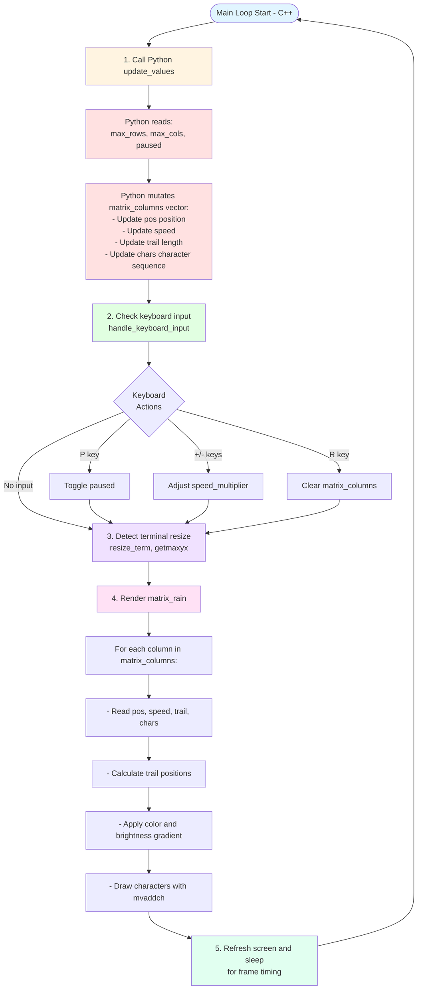

# C++ Values Exposed to Python (Matrix Rain Animation Example)

## Overview

This project exposes C++ scalars, structs, and vectors to Python using a reflection layer plus Python proxy bindings. It demonstrates the framework by animating a "Matrix rain" effect where Python controls animation state (a bound vector of struct) and C++ renders to terminal using curses.

Key highlights:
- Pure C++ reflection layer (no Python dependencies)
- Python proxies for structs and vectors with safe memory handling
- Parent tracking for vector element safety
- Real-time animation driven by Python, rendered by C++
- Extensive architecture and design documentation

## Project Layout

- `main.cpp` - Application entry point, Python embedding, and curses rendering loop
- `reflection_value.hpp` / `reflection_struct.hpp` / `reflection_vector.hpp` - Reflection layer
- `value_interface.hpp` / `value_interface.cpp` - Binding registry and type dispatch
- `python_proxy.hpp` / `python_proxy.cpp` - Python proxy types
- `python_bind.hpp` - Scalar conversion helpers
- `matrix_rain_animation_data.cpp` / `matrix_rain_animation_data.hpp` - MatrixColumn struct and animation state vector
- `scripts/controller.py` - Python animation controller
- `doc/` - Architecture and design documentation

## Requirements

- CMake 3.15+
- C++20 compiler
- Python development headers and libraries
- Preferred Python version: 3.14.2 (see `python_required_version.txt`)

## Build

From this directory:

```bash
cmake -S . -B build
cmake --build build
```

Notes:
- On Windows, the build copies the Python DLL and `scripts/` folder next to the executable.
- On Linux/macOS, ensure your system Python development package is installed.

## Run

After build, run the executable from the build output directory. Example:

```bash
./build/EmbeddedPythonLoop
```

If you built with a multi-config generator (Visual Studio), run the executable from the configuration folder (e.g., `build/Debug/EmbeddedPythonLoop.exe`).

### Keyboard Controls

- **P** - Pause/Resume animation
- **+** - Increase speed (0.1x to 3.0x)
- **-** - Decrease speed
- **R** - Reset (clear all columns and restart)

## How It Works

### Architecture Overview

The Matrix rain demo demonstrates a **split-responsibility design**:

**C++ Side (main.cpp):**
- Embeds Python interpreter
- Owns the curses terminal and render loop
- Exposes C++ data structures to Python via binding system
- Calls Python's `update_values()` function each frame
- Reads animation state from bound vector and renders to terminal
- Handles keyboard input and terminal resize

**Python Side (controller.py):**
- Controls animation logic
- Mutates C++ data structures directly via proxy interfaces
- Updates column positions, speeds, trails, and character sequences
- Resets off-screen columns for continuous rain effect
- No return values needed - works by side effects on bound data

### Data Flow



### Renderer Logic (C++ - render_matrix_rain)

The renderer reads animation state from the bound `matrix_columns` vector and draws characters to the terminal:

**1. Column Iteration**
```cpp
for (size_t x = 0; x < columns.size() && x < max_cols; ++x)
```
- Iterates through each column in the vector
- Stops at terminal width boundary to avoid overflow
- Each column represents one vertical line of falling characters

**2. Read Animation State**
```cpp
int pos = static_cast<int>(column.pos);      // Head position (row)
int trail = column.trail;                     // Trail length
const std::string &chars = column.chars;     // Character sequence
```
- `pos`: Y-coordinate of the trail head (bottom of visible trail)
- `trail`: Number of characters in this column's trail (5-20)
- `chars`: String of random characters to display (length matches trail)

**3. Trail Drawing**
```cpp
for (int i = 0; i < trail; ++i)
{
    int y = pos - (trail - 1 - i);  // Calculate Y position for this character
    // Draw from top of trail (pos - trail + 1) to head (pos)
}
```
- Trail flows downward from `pos`
- Character at index `i=0` is at the top (dimmest)
- Character at index `i=trail-1` is the head (brightest)

**4. Brightness Gradient**
```cpp
if (i == trail - 1)                   // Head character
    attron(COLOR_PAIR(6) | A_BOLD);   // White + Bold = maximum brightness
else if (i >= trail - trail / 3)      // Top third of trail
    attron(A_BOLD);                   // Bold color
// else: normal intensity (dim tail)
```
- Creates visual depth with 3 brightness levels
- Head glows white, upper trail is bright, lower trail dims

**5. Character Rendering**
```cpp
mvaddch(y, static_cast<int>(x), chars[i]);
```
- Places character at calculated position
- `x` is column index (horizontal position)
- `y` is calculated from `pos` and trail offset
- `chars[i]` is the character at this position in the trail

### Python Update Logic (controller.py - update_values)

The Python controller updates animation state each frame by mutating C++ bound structures:

**1. Read Terminal State**
```python
max_cols = cpp.max_cols    # Terminal width
max_rows = cpp.max_rows    # Terminal height
paused = cpp.paused        # Pause flag (ByteBool from C++)
speed_multiplier = cpp.speed_multiplier  # Speed adjustment (1.0 = normal)
```
- Reads C++ bound scalar values
- Terminal size needed for boundary checks and resets

**2. Handle Pause**
```python
if paused and initialized:
    return  # Skip updates but keep rendering
```
- Early exit if paused (keyboard 'P' pressed)
- C++ continues rendering, but positions don't change

**3. Initialize Columns (First Frame or After Resize)**
```python
while len(columns) < max_cols:
    column = columns.append_new()           # Create new MatrixColumn struct
    column.pos = float(random.randint(...)) # Initial position
    column.speed = float(random.uniform(2.0, 4.0) * speed_multiplier)
    column.trail = int(random.randint(5, 20))
    column.chars = "".join(random.choice(MATRIX_CHARS) for _ in range(column.trail))
```
- Ensures one column per terminal column
- VectorProxy `append_new()` creates C++ struct instances
- Direct field assignment via proxy

**4. Update Each Column**
```python
for index in range(visible_cols):
    column = columns[index]
    
    # Move down by speed
    column.pos = float(column.pos + column.speed)
```
- Mutates `pos` field to move column downward
- Speed multiplied by `speed_multiplier` (keyboard +/- controls)

**5. Reset Off-Screen Columns**
```python
if column.pos > max_rows + column.trail:
    # Column completely off-screen, recycle it
    column.pos = float(random.randint(-column.trail * 2, 0))  # Start above screen
    column.speed = float(random.uniform(2.0, 4.0) * speed_multiplier)
    column.trail = int(random.randint(5, 20))
    column.chars = "".join(random.choice(MATRIX_CHARS) for _ in range(column.trail))
```
- Detects when column head passes bottom edge
- Resets to random position above screen (negative Y)
- Randomizes speed, trail length, and characters for variety

**6. Character Mutation (Optional)**
```python
if random.random() < 0.1:  # 10% chance per frame
    mutation_index = random.randint(0, column.trail - 1)
    chars = chars[:mutation_index] + random.choice(MATRIX_CHARS) + chars[mutation_index + 1:]
    column.chars = chars
```
- Randomly changes one character in the trail for visual variety
- Creates "glitching" effect common in Matrix rain

### Key Design Patterns

**1. Zero-Copy Data Sharing**
- C++ owns `matrix_columns` vector
- Python gets proxy references, not copies
- Mutations directly affect C++ memory
- No serialization overhead

**2. Asymmetric Terminal Resize**
- Width increase: Python adds new columns
- Width decrease: Extra columns ignored but kept (optimization)
- Height change: Columns automatically adapt (reset threshold changes)

**3. Frame-Perfect Synchronization**
- C++ controls frame rate (30 FPS or ~33ms per frame)
- Python update happens before each render
- Consistent visual timing regardless of Python logic complexity

## License

See the repository-level `LICENSE` file.
